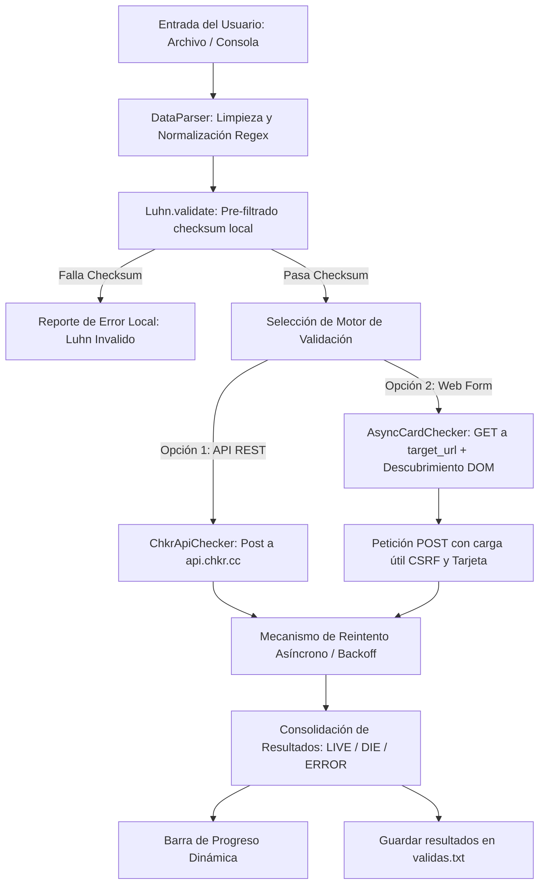

# 🪷 Loto Card Toolkit

<p align="center">
  
  
  
</p>

<p align="center">
  <b>Una suite de ingeniería de software robusta, modular y concurrente para la simulación, generación y validación técnica de tarjetas de pago.</b>
  <br />
  Desarrollado con arquitectura orientada a objetos (POO), patrones de diseño limpios y optimización para entornos de recursos limitados.
</p>

<p align="center">
  <a href="https://github.com/KinglotusPe"><strong>Explorar GitHub »</strong></a>
  ·
  <a href="https://t.me/addlist/wigY-9BP0cEwMDMx"><strong>Canal de Telegram (El Reino de Loto) »</strong></a>
</p>

---

## 📖 Tabla de Contenidos
1. [Descripción del Proyecto](#-descripción-del-proyecto)
2. [Arquitectura y Patrones de Diseño](#-arquitectura-y-patrones-de-diseño)
3. [Flujo de Validación (Arquitectura Asíncrona)](#-flujo-de-validación-arquitectura-asíncrona)
4. [Instalación y Despliegue](#-instalación-y-despliegue)
5. [Guía de Uso](#-guía-de-uso)
6. [Estructura de Módulos](#-estructura-de-módulos)
7. [Aviso Legal e Información de Seguridad](#-aviso-legal-e-información-de-seguridad)

---

## 🪷 Descripción del Proyecto

**Loto Card Toolkit** es una herramienta de consola optimizada para desarrolladores, auditores de seguridad y testers de pasarelas de pago. La aplicación unifica la generación sintética de credenciales mediante el **Algoritmo de Luhn** y su posterior validación automatizada contra servicios en línea.

### Diferenciadores Técnicos:
* **Scrapeo Dinámico**: En lugar de utilizar cargas estáticas (payloads rígidos), el motor analiza dinámicamente el DOM (HTML) del portal de destino para descubrir de forma autónoma el input de la tarjeta, los campos ocultos de seguridad (tokens CSRF) y los contenedores de respuesta.
* **Mecanismos de Resiliencia (DevSecOps)**: El validador incluye políticas de reintento automático mediante **retroceso exponencial (exponential backoff)** para mitigar bloqueos temporales por saturación de red o códigos HTTP 429 (Too Many Requests).
* **Concurrencia Controlada**: Control de flujo mediante semáforos asíncronos (`asyncio.Semaphore`) para evitar el baneo de IPs y asegurar un consumo óptimo de memoria RAM (diseñado para VPS con menos de 512MB RAM).

---

## 📐 Arquitectura y Patrones de Diseño

El sistema está diseñado bajo los principios **SOLID** y el paradigma de **Programación Orientada a Objetos (POO)**:

* **Single Responsibility Principle (SRP)**: Cada módulo en la carpeta `core/` tiene una única responsabilidad bien definida (Luhn matemático, Scraper HTML, Parser regex, Orquestador).
* **Open/Closed Principle (OCP)**: Los validadores en línea heredan o implementan interfaces estructuradas, lo cual permite añadir nuevos motores de validación web o APIs sin alterar el código del orquestador principal.
* **Separación de Capas (UI/Core)**: La interfaz gráfica de consola ([main.py](file:///d:/ideas/Tarjetas/main.py)) es completamente independiente de las clases que manejan la lógica de negocio y las peticiones de red.

---

## 🔄 Flujo de Validación (Arquitectura Asíncrona)

El siguiente diagrama detalla cómo el sistema gestiona los datos desde la entrada del usuario hasta la consolidación de resultados:



---

## 🚀 Instalación y Despliegue

### Requisitos Previos
* **Python 3.11 o superior** (probado y compatible hasta Python 3.14).
* Conectividad a internet activa.

### Pasos de Despliegue en Windows
```bash
# 1. Clonar el repositorio
git clone https://github.com/KinglotusPe/loto-card-toolkit.git
cd loto-card-toolkit

# 2. Configurar el entorno virtual aislado
python -m venv .venv
.venv\Scripts\activate

# 3. Instalar las dependencias core
pip install -r requirements.txt
```

### Pasos de Despliegue en Linux / macOS
```bash
# 1. Clonar el repositorio
git clone https://github.com/KinglotusPe/loto-card-toolkit.git
cd loto-card-toolkit

# 2. Configurar el entorno virtual aislado
python3 -m venv .venv
source .venv/bin/activate

# 3. Instalar las dependencias core
pip install -r requirements.txt
```

---

## 💻 Guía de Uso

Ejecuta la suite principal:
```bash
python main.py
```

### Funciones Disponibles:

| Operación | Entrada Soportada | Flujo de Operación |
| :--- | :--- | :--- |
| **Generar Tarjetas** | Consola Interactiva | Permite seleccionar marcas oficiales (Visa, Mastercard, Amex, Discover), definir longitudes personalizadas o ingresar patrones con comodines `x`. Admite especificación de volumen (Individual o Lotes). |
| **Validar Tarjetas** | Texto Manual / Archivos | Filtra las tarjetas usando el algoritmo matemático local. Las que pasan el filtro se pueden validar en línea concurrentemente con la API chkr.cc o contra un validador web dinámico de tu elección. |

> [!TIP]
> Al ingresar tarjetas manualmente, puedes pegar bloques desestructurados. El sistema extraerá de forma automática los números de tarjeta, fechas y CVVs gracias al potente motor Regex del [core/parser.py](file:///d:/ideas/Tarjetas/core/parser.py).

---

## 📁 Estructura de Módulos

El proyecto está organizado de la siguiente manera:

```
loto-card-toolkit/
│
├── core/
│   ├── __init__.py         # Expone la API interna del toolkit.
│   ├── luhn.py             # Lógica matemática del Algoritmo de Luhn (Módulo 10).
│   ├── generator.py        # Generador seguro (Brand / BIN / Custom patterns).
│   ├── checker.py          # Clientes asíncronos HTTPX (API REST y Web Scraper).
│   ├── parser.py           # Normalización regex avanzada de inputs.
│   └── utils.py            # Logger estructurado y ProgressBar en consola.
│
├── main.py                 # Punto de entrada / Interfaz de usuario (TUI).
├── requirements.txt        # Dependencias externas (httpx, beautifulsoup4).
└── README.md               # Documentación técnica del proyecto.
```

---

## ⚖️ Aviso Legal e Información de Seguridad

> [!WARNING]  
> **Exención de Responsabilidad**: Esta herramienta ha sido desarrollada exclusivamente para fines educativos, investigación académica y auditorías de seguridad autorizadas (auditorías PCI-DSS / pruebas de penetración). El uso indebido de este software para validar credenciales financieras sin el consentimiento explícito del propietario del sistema es estrictamente ilegal y está sujeto a sanciones penales según las leyes de ciberseguridad internacionales.
> 
> El desarrollador **KinglotusPe** no se hace responsable de daños, reclamos o actividades ilícitas realizadas con esta herramienta. Usa este software de forma ética y legal.
